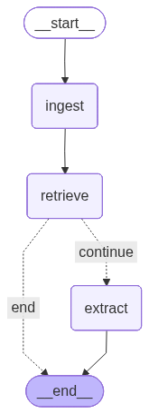

# LangGraph-App
Small application using LangGraph for interview with Ericsson.

Here is a visual representation of the LangGraph workflow:

This graph shows the flow of data through the various nodes:
1.  **Ingest**: Reads the log file and creates document chunks (per row). Uses OpenAI API to create embedding vectors and store it together with chunks in FAISS vector to enable quick retrivement.
2.  **Retrieve**: Searches for relevant log snippets. Uses FAISS retriver as "search_engine" for relevant embedding vectors based on the query: "find all lines with error codes, error messages, or failure alerts".
3.  **Extract**: Uses an LLM (gpt-40-mini) to extract error codes. The model is prompted with system instructions as well as the error messages retrived from before.
